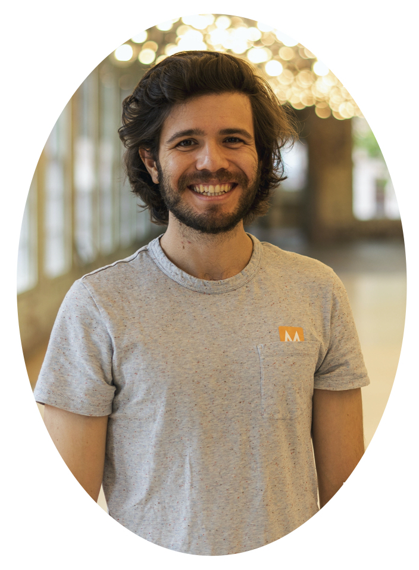
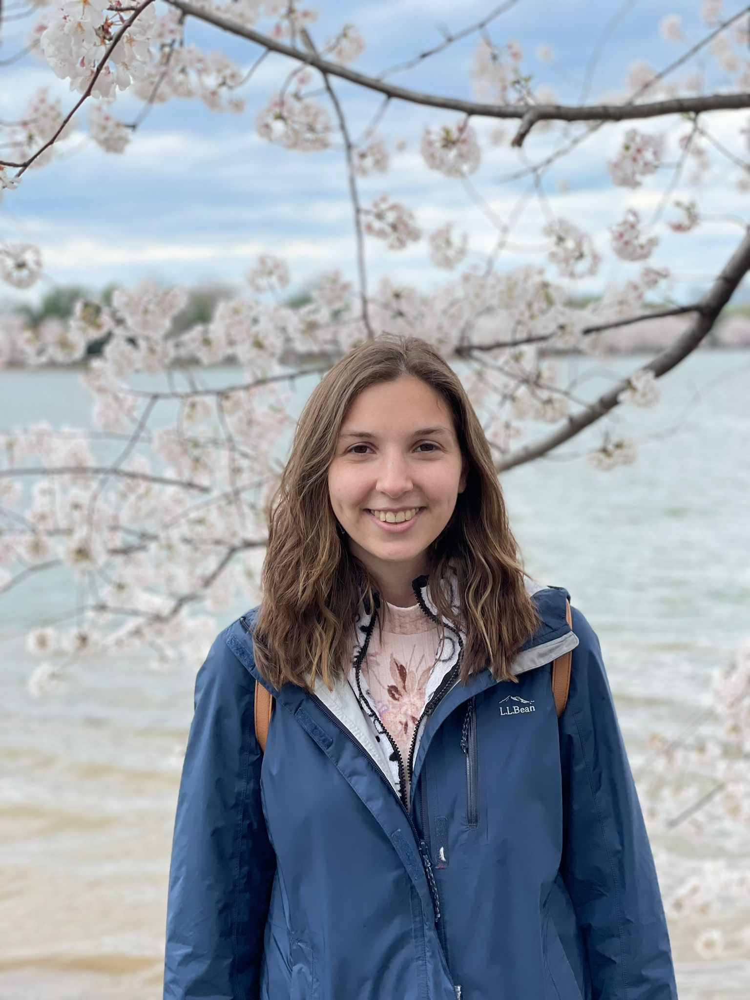
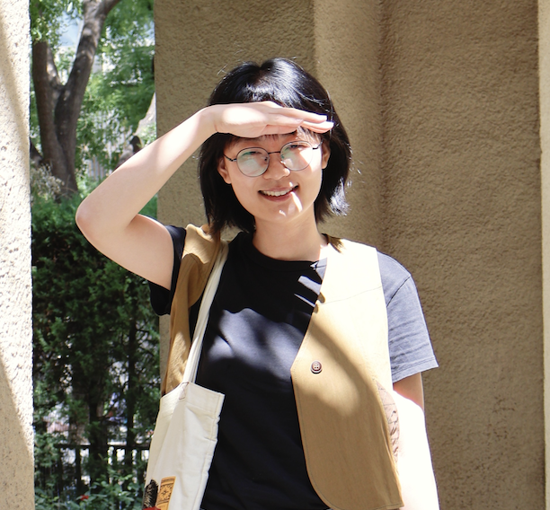
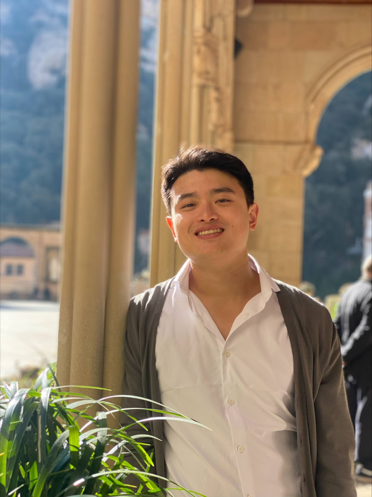
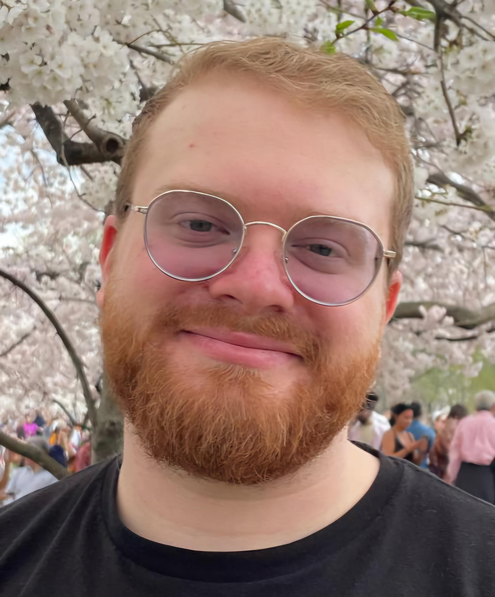

## Ethan Gotlieb Wilcox

Ethan is an Assistant Professor of Computational Linguistics and the director of PICoL. He is interested in how we learn language from limited inputs and how we process it in real-time. To answer these questions, he and the PICoL team use a variety of methods, including psycholinguistics experiments, formal mathematical and statistical models, and modern machine-learning techniques.

[GitHub](https://github.com/wilcoxeg) [Website](https://wilcoxeg.github.io/)

---

## Lauren Levine

Lauren is a Ph.D. candidate in Computational Linguistics at Georgetown University,
within the department of Linguistics. Her research focuses on the discourse phenomenon of bridging,
where the referent an anaphor is inferable via the comprehension of a non-identical associative antecedent.
Her work focuses on linguistic annotation/resource creation, modeling for the task for bridging resolution,
and investigating bridging with relation to LLMs and natural language reasoning.
She is also generally interested in corpus linguistics and computational semantics.

[GitHub](https://github.com/lauren-lizzy-levine)

---

## Xiulin Yang

Xiulin Yang is a second-year PhD student in Computational Linguistics at Georgetown University.
Her research interests include language modeling, language universals, (compositional) generalization of neural
networks, LLMs, and semantics. 

[GitHub](https://github.com/xiulinyang) [Website](https://xiulinyang.github.io)

---

## Hyun Min

Hyun is a first-year PhD student in the computational concentration from Busan, Korea.
He is interested in robust representations of structure in language, and how humans and statistical learners
predict structure and resolve ambiguities. Prior to Georgetown, he was an NLP engineer at NCSOFT.

[GitHub](https://github.com/aatlantise) [Website](https://aatlantise.science/)

---

## Wesley Scivetti

Wes is a 3rd year Ph.D. candidate in Computational Linguistics. His research centers on the linguistic interpretability of language models, with particular focus on using Construction Grammar to understand language model performance. He is also interested in corpus linguistics and resource creation, low-resource NLP, information theory, and models with human-scale training data.

[GitHub](https://github.com/WesScivetti) [Website](https://wesleyscivetti.georgetown.domains/)

---

## Dan DeGenaro

Dan is originally from White Plains, NY. He is finishing up his MS in computational linguistics, after which
he will begin his PhD in computer science, both at Georgetown. Dan is interested in the development of safe,
ethical, and energy-efficient multimodal intelligent systems that serve the needs of everyday people while
respecting important rights such as privacy, copyright, and the right to be forgotten. He is also interested in
low-resource machine translation and speech recognition,
multilingual NLP, and information-theoretic approaches to language modeling and linguistics.

[GitHub](https://github.com/ddegenaro) [Website](https://ddegenaro.github.io/)

---

## Lanni Bu

Lanni is a first year Master's student in computational linguistics.
Her research interests include computational psycholinguistics and cognitive modeling.

[GitHub](https://github.com/Lanni-ni)
